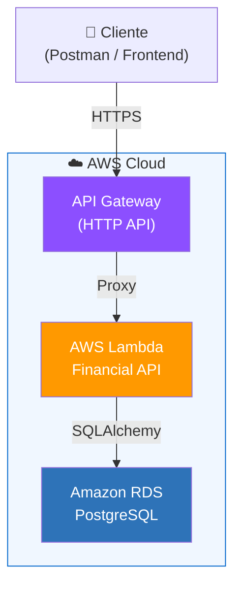
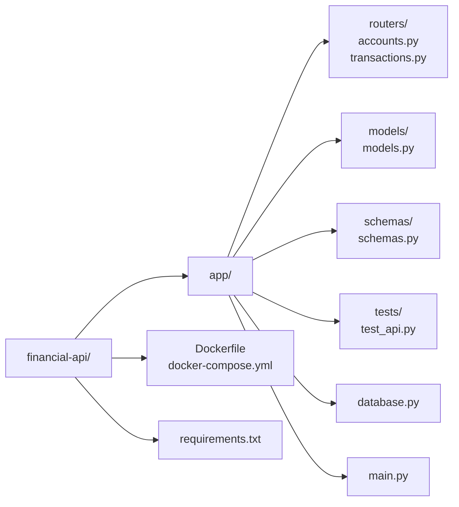
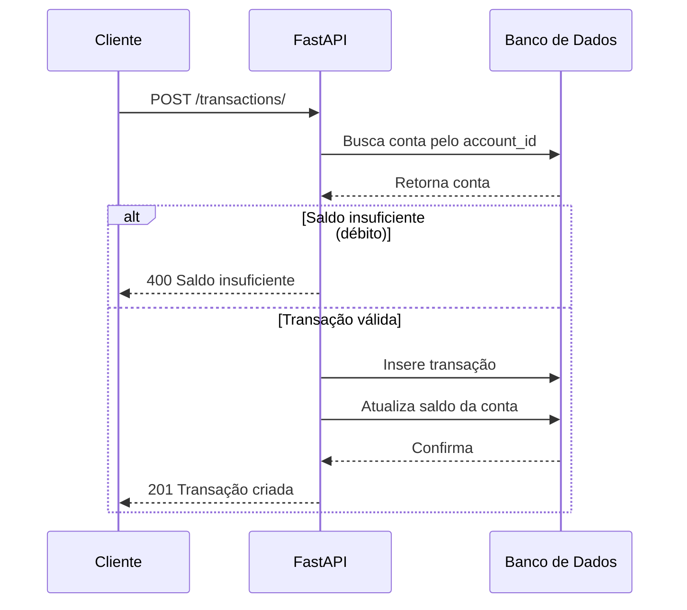
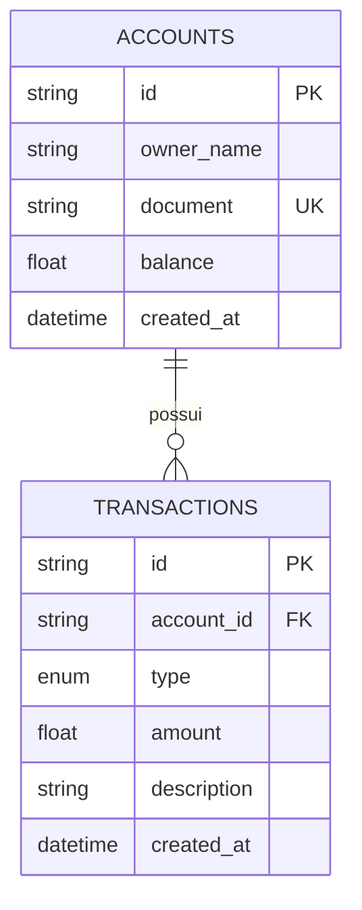

# 💳 Financial API

API REST para gerenciamento de contas e transações bancárias, construída com **FastAPI + SQLAlchemy + Docker**, com deploy na **AWS Lambda via AWS CLI**.

---

## 🏗️ Arquitetura Geral



---

## 📦 Estrutura do Projeto



---

## 🔄 Fluxo de uma Transação



---

## 📊 Modelo de Dados



---

## 🚀 Rodando Localmente

### Com Docker Compose (recomendado)
```bash
docker-compose up --build
```

### Sem Docker
```bash
pip install -r requirements.txt
uvicorn app.main:app --reload
```

Acesse a documentação Swagger em: **http://localhost:8000/docs**

[Financial-API-Swagger-UI](https://i.postimg.cc/D04GSNYt/Financial-API-Swagger-UI-1.png)

---

## 🧪 Rodando os Testes

```bash
pytest app/tests/test_api.py -v
```

Saída esperada:
```
PASSED test_health_check
PASSED test_create_account
PASSED test_create_account_duplicate_document
PASSED test_get_account
PASSED test_get_account_not_found
PASSED test_create_credit_transaction
PASSED test_create_debit_transaction
PASSED test_debit_insufficient_balance
PASSED test_get_statement
```

---

## ☁️ Deploy na AWS com AWS CLI

### Pré-requisitos
```bash
# Instalar AWS CLI
pip install awscli

# Configurar credenciais
aws configure
# AWS Access Key ID: <sua-key>
# AWS Secret Access Key: <sua-secret>
# Default region: us-east-1
# Default output format: json
```

### Passo 1 - Criar função Lambda (com Mangum para adaptar FastAPI)
```bash
pip install mangum
```

Adicione ao final do `app/main.py`:
```python
from mangum import Mangum
handler = Mangum(app)
```

### Passo 2 - Empacotar o projeto
```bash
pip install -r requirements.txt -t package/
cp -r app package/
cd package && zip -r ../financial-api.zip . && cd ..
```

### Passo 3 - Criar role IAM para o Lambda
```bash
aws iam create-role \
  --role-name financial-api-role \
  --assume-role-policy-document '{
    "Version": "2012-10-17",
    "Statement": [{
      "Effect": "Allow",
      "Principal": {"Service": "lambda.amazonaws.com"},
      "Action": "sts:AssumeRole"
    }]
  }'

aws iam attach-role-policy \
  --role-name financial-api-role \
  --policy-arn arn:aws:iam::aws:policy/service-role/AWSLambdaBasicExecutionRole
```

### Passo 4 - Criar a função Lambda
```bash
aws lambda create-function \
  --function-name financial-api \
  --runtime python3.11 \
  --role arn:aws:iam::<SEU-ACCOUNT-ID>:role/financial-api-role \
  --handler app.main.handler \
  --zip-file fileb://financial-api.zip \
  --timeout 30 \
  --memory-size 256
```

### Passo 5 - Criar API Gateway
```bash
# Criar HTTP API
aws apigatewayv2 create-api \
  --name financial-api-gateway \
  --protocol-type HTTP \
  --target arn:aws:lambda:us-east-1:<SEU-ACCOUNT-ID>:function:financial-api
```

### Passo 6 - Atualizar função após mudanças
```bash
# Reempacotar e atualizar
cd package && zip -r ../financial-api.zip . && cd ..

aws lambda update-function-code \
  --function-name financial-api \
  --zip-file fileb://financial-api.zip
```

---

## 📡 Endpoints

| Método | Endpoint | Descrição |
|--------|----------|-----------|
| GET | `/health` | Health check |
| POST | `/accounts/` | Criar conta |
| GET | `/accounts/` | Listar contas |
| GET | `/accounts/{id}` | Buscar conta |
| DELETE | `/accounts/{id}` | Remover conta |
| POST | `/transactions/` | Registrar transação |
| GET | `/transactions/statement/{id}` | Extrato com saldo diário |

---

## 🧠 Decisões Técnicas

**Por que FastAPI?**
Alta performance, documentação automática via Swagger, tipagem com Pydantic e sintaxe limpa.

**Por que SQLAlchemy?**
ORM maduro, suporta múltiplos bancos (SQLite local → PostgreSQL em produção), sem lock-in.

**Query de saldo diário:**
A query do endpoint `/statement` usa agregação por `DATE(created_at)` com CASE WHEN para separar créditos e débitos - evitando full scan com filtros de data e sem rodar direto em produção (ideal via réplica de leitura no RDS).

---

## 👨‍💻 Autor

**Rafael Araujo Trindade** - Data Engineer  
[LinkedIn](https://linkedin.com/in/rafatrindade) · [GitHub](https://github.com/rafa-trindade)
